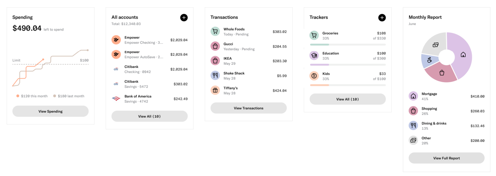

To install server dependencies:

```sh
npm i
```

To install client dependencies:

```sh
npm run install-client
```

To run the server:

```sh
npm run server
```

To run the client:

```sh
npm run client
```

# Introduction

You are working for a fintech company which offers a financial mobile application.

The application's main feature set is to connect to third party banks and aggregate a customer's account and associated transaction information. The purpose is to provide notifications of changes in their account and to also provide budgeting capabilities.

It is understood that this functionality is now often provided by individual bank apps, however this application will be a one stop shop to aggregate multiple bank accounts.

As the company’s users have been requesting for web-based access, the company has decided to offer a web application equivalent of its current native mobile application feature set.

The brief high level architecture of the system is described as:

- A native mobile app for both Android and iOS
- A RESTful API hosted from a cloud provider
- Cloud-based services to provide features that include, but are not restricted to:
  Emails, SMS, etc.

# Functional Requirements

Feature: Spend tracking

Concept: A spend tracker defines an amount set (limit) for all transactions across the customer’s account which meet some criteria (e.g. category, or transaction name) for a given time period (weekly and/or monthly). It should be named/labeled for differentiation and display purposes.

## User Stories:

- The customer must be able to view their accounts connected with the company and the balances associated with each account. (You may assume that 1 or more accounts have already been created with associated transactions)
- The customer must be able to view their transaction history for any selected account.
- The customer should be able to create, view, update, and remove spend trackers.
- The customer should be able to visualize their spending over a period of at least 1 week, so as to determine if they have exceeded their budgeted spend limit for any pre-determined category.

# Task

For the purposes of evaluation on the functional requirements, you are to:

- Create a web application in the provided React repo.
  - You are expected to produce a layout for the application in any styling method of choice (e.g. css, scss, tailwind, etc)
  - You are expected to create React components for use within the layout for creating views for each feature
  - You are expected to utilize React hooks for managing application state
  - You are expected to utilize the API endpoints provided and may adjust any mocked data if necessary to fit your needs.
  - You may, but are not required to, implement pages and routes using a familiar routing library of your choice
- You will need to make various assumptions during your implementation and design to simplify the submission. These assumptions should be listed along with reasoning in a markdown file in the repo
  - e.g. API request/session security will be done using x method for x benefits but this has been excluded from the solution and listed here as an assumption

# Submission and Evaluation

You should have produced a working front-end web application for submission. Aim for completing the exercise in no more than 5 hours.

You are required to submit the exercise prior to your onsite interview, package it appropriately and provide ample documentation where necessary.

The submission will be evaluated together with your interviewers during the technical onsite.
We will be going over the design and technical decisions you have made as part of implementation.

# Design Guidance

To aid in the conception of the feature, these are some designs from the native mobile application, you may use these to create a design of your own that is appropriate for the web interface. You are not expected to reproduce these views like for like.



